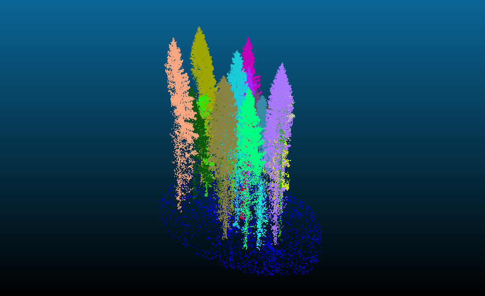
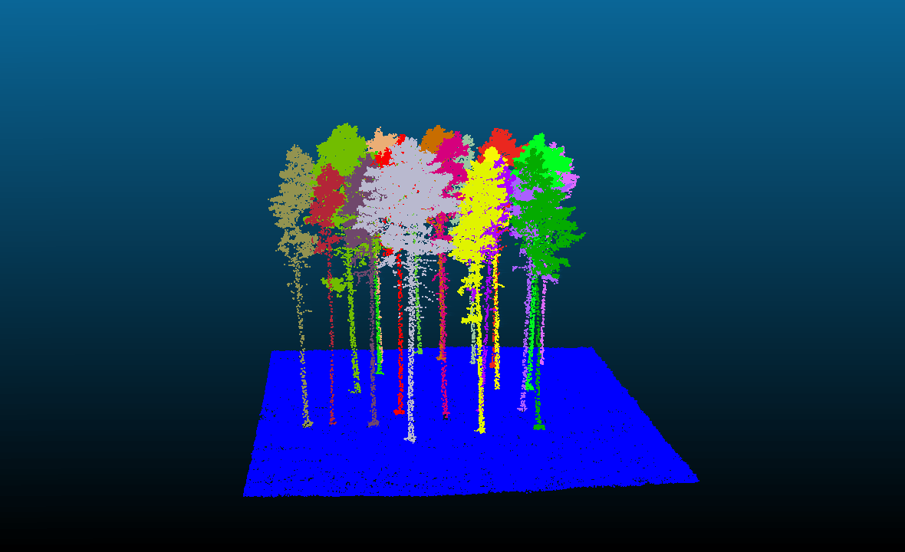
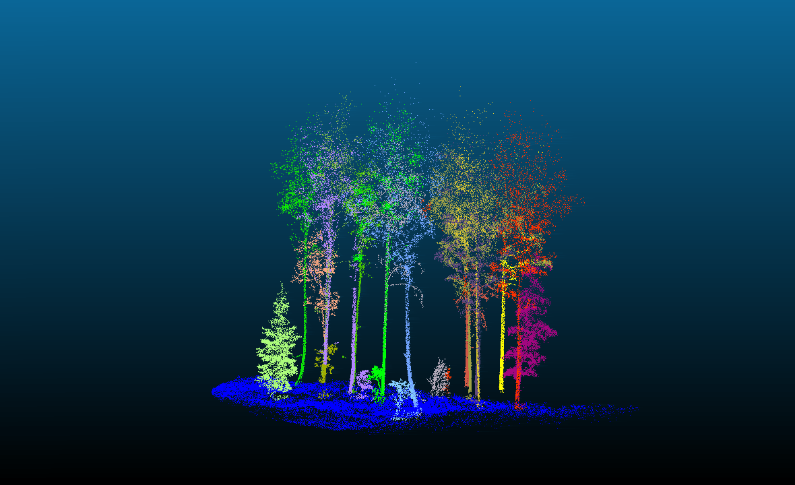
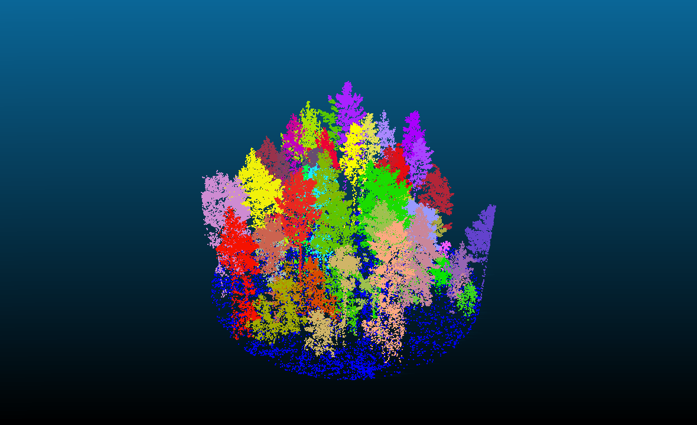
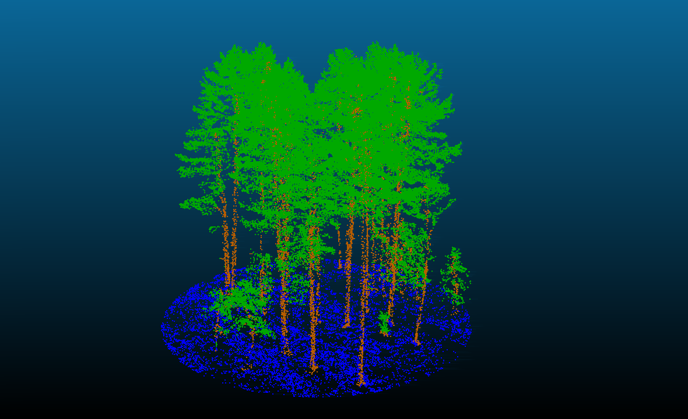

# 🌲 3D Forest Instance & Semantic Segmentation from Synthetic LiDAR

**Transformer-based instance segmentation of individual trees (trunk + crown) from 3D point clouds — trained entirely on synthetic data, tested zero-shot on real forest scans.**

  

> Portfolio showcase — training/inference code is private. Happy to walk through it live on request, see [Contact](#contact).

---

## TL;DR

- Trained **100% on synthetic** forest scenes (own Blender-based generator, separate project) — no real annotated data used.
- Tested zero-shot on **[FOR-instance v2](https://paperswithcode.com/dataset/for-instance)**, a real, public forest LiDAR benchmark (ALS/UAV/MLS/TLS).
- Two-stage system: swappable backbone (SpConv / PointNet++ / PointNeXt / Point Transformer V3) + DETR-style transformer decoder with trunk-anchored queries and geometry-aware attention.
- Works at a budget-friendly **~100 pts/m² - 200 pts/m²** density, on free/low-tier cloud GPUs (Paperspace).
- **Works well** on simple, well-separated stands (spruce, pine, clean broadleaf). **Struggles** on dense, multi-story stands with heavy understory — that's the current focus.
- Reference point: [ForestFormer3D](https://github.com/SmartForest-no/ForestFormer3D) (SmartForest-no) — architecture diverges substantially from it.

---

## Synthetic training data

Procedurally generated forest scenes — trees, terrain, understory placed with collision-aware 3D logic, fully annotated (semantic + per-tree instance ID) at generation time, no manual labeling.

 

   <i>Synthetic dataset example</i>
     
  

   <i>Custom augmentation pipeline (20+ forest-specific transforms)</i>
     
  
  
  
  

---

## Results

Simple conifer stands (spruce, pine) and well-separated broadleaf: strong results. Dense, multi-story stands with rich understory: still a weak point, and the main direction of ongoing work.

 

   <i>Full-scene predictions on real, unseen forest plots (FOR-instance v2, ~100 pts/m²)</i>

 

<table align="center">
  <tr>
    <td></td>
    <td></td>
  </tr>
  <tr>
    <td></td>
    <td></td>
  </tr>
  <tr>
    <td colspan="2" align="center"></td>
  </tr>
</table>

 

   <i>Inside a training step: GT vs. predicted semantics vs. query seeds vs. final instances</i>
     
  

   <i>Full-scene inference — merged point clouds, predicted semantics and instances</i>
     
  
  
  
  
  
  
  
  
  
  
  
  

  

---

## Tech stack

`PyTorch` · `PyTorch Geometric` · `spconv` · custom Point Transformer V3 integration · `torchmetrics` · `scipy` · `laspy` · `Weights & Biases`

---

## Status

Active work in progress — architecture, augmentations, and evaluation are still being iterated on, especially sim-to-real transfer on dense/multi-story scenes. Happy to go deeper into any part of it in conversation.

## Contact

**Łukasz Słowik** — open to opportunities in 3D perception / point cloud ML / applied CV.
[[LinkedIn](https://www.linkedin.com/in/%C5%82ukasz-s%C5%82owik-650290226/)] · Email: slowik.lukasz1988@gmail.com