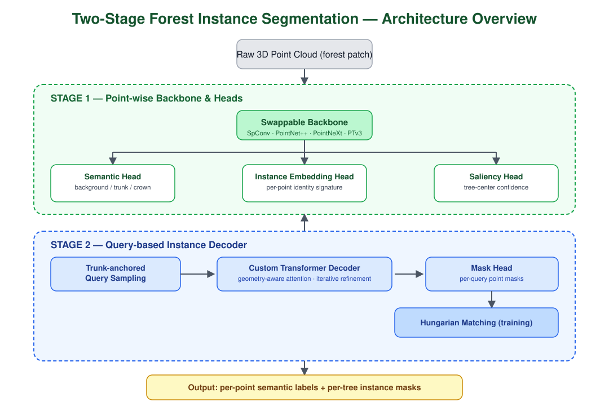

# 🌲 3D Forest Instance & Semantic Segmentation from Synthetic LiDAR

**Transformer-based, DETR/Mask3D-style instance segmentation of individual trees (trunk + crown) from raw 3D point clouds, trained entirely on synthetic forest data.**

  

> This repository is a **portfolio showcase**. The training/inference codebase is private; this page documents the system design, the engineering decisions behind it, and the results. I'm happy to walk through the code or run a live demo on request — see [Contact](#contact).
>
> **Status: active work in progress.** Numbers below are from the current iteration of a pipeline trained purely on synthetic data and evaluated zero-shot on real point clouds — they're shared as-is, warts included, because I think the honest trajectory is more useful to see than a polished snapshot.

---

## TL;DR

- **Task:** joint semantic segmentation (background / trunk / crown) + **panoptic-style instance segmentation** (one mask per individual tree) directly on unordered 3D point clouds.
- **Data:** fully **synthetic**, procedurally generated forest scenes (Blender-based pipeline, separate project) — no manual point-level annotation required.
- **Architecture:** a two-stage, config-driven system — a swappable point-cloud backbone (SpConv / PointNet++ / PointNeXt / Point Transformer V3) feeding a DETR-style transformer decoder with a custom geometry-aware attention bias, saliency-guided query sampling, and Hungarian one-to-one mask matching.
- **Budget-aware by design:** point clouds are density-downsampled to a fixed **~100 points/m²** before training/inference — a low-density regime chosen to match what budget cloud GPUs (Paperspace Gradient) can actually process. This is a deliberate scope choice — the goal is a model that **generalizes robustly at practical, low density**, not one that chases maximum achievable resolution on narrow, compute-heavy sub-problems (e.g. separating individual tangled/overlapping branches). Trading marginal gains that only show up on expensive, high-density setups for real-world usability and reproducibility on modest hardware.
- **Why it's interesting:** forests are a genuinely hard instance-segmentation domain — trees overlap in canopy, trunks are thin and easy to lose at low point density, and "objects" don't have clean bounding boxes. The whole augmentation and architecture design is built around those specific failure modes.
- **Built to iterate, not just to run once:** in practice this grew into a small research harness — a single config drives backbone choice, query-sampling strategy, loss weighting, and 20+ augmentation toggles, so new ideas (a different backbone, a different sampler, a different geometric bias) can be tried as a config change rather than a rewrite. Most of the design decisions described below came out of exactly this kind of fast iteration loop.

---

## 1. Motivation

Automated per-tree inventories (stem count, crown volume, biomass, health monitoring) from LiDAR/photogrammetry point clouds are valuable for forestry and urban greenery management, but:

- point-level ground truth for real forest scans is extremely expensive to produce (dense canopy occlusion, ambiguous crown boundaries),
- publicly available annotated forest LiDAR datasets are small and inconsistent in density/sensor characteristics,
- classic clustering-based instance segmentation (e.g. watershed on CHM, DBSCAN on trunks) breaks down in dense stands with overlapping crowns.

This project explores a **synthetic-data-first** approach: generate diverse, densely-labeled forest scenes procedurally, and design a model + augmentation pipeline strong enough to generalize from synthetic to real point clouds.

The overall system design was informed in part by ideas from [**ForestFormer3D**](https://github.com/SmartForest-no/ForestFormer3D) (SmartForest-no) — a great reference point for transformer-based forest point cloud segmentation. The architecture, sampling strategy, and training pipeline here diverge substantially from it, but it was a valuable starting point while exploring the design space.

---

## 2. Data

- Scenes are exported as `.laz`/`.las` patches with per-point semantic labels (`background` / `trunk` / `crown`) and per-point instance IDs (`treeID`).
- Generation pipeline (Blender-based procedural forest + point-cloud simulation) is a **separate project** — not part of this repo.
- Training patches: ~20 m × 20 m tiles with a 1 m margin, resampled to a **fixed target density of ~100 points/m²** via an **area-aware adaptive sampler** (estimates true footprint area from an occupancy grid rather than assuming a fixed patch size, so density stays consistent across partially-empty tiles). This is a deliberately low-density working regime, not a "best case" cherry-picked density — the same budget applies at both training and inference time.
- **Training is 100% synthetic** — no real annotated data is used to fit the model. Generalization is checked zero-shot on **29 real-world plots (~1,400 GT trees) spanning 8 independent acquisition platforms** from the [FOR-instance v2](https://paperswithcode.com/dataset/for-instance) benchmark (ALS, UAV, mobile and terrestrial laser scanning) — giving an honest, deliberately hard sim-to-real signal rather than only a synthetic-to-synthetic validation split.
- The whole pipeline (data generation → training → evaluation) is designed to run on **budget cloud GPUs** (Paperspace Gradient free/low-tier instances) — a deliberate constraint that shaped a number of engineering choices throughout the training setup, from memory management to normalization and loss-weighting strategy.

 

   <i>Dataset example</i>
    
    
  

## 3. Method

### 3.1 Overview

The model is a **two-stage** point cloud segmentation system:

1. **Stage 1 — point-wise backbone.** Any of four interchangeable backbones (selected via config) produces a per-point feature vector:
   - `SparseConv (SpConv)` — 4-level sparse 3D U-Net, the default / best-performing backbone for this task,
   - `PointNet++`, `PointNeXt` — custom pure-PyTorch FPS/kNN implementations (no compiled CUDA extensions required),
   - `Point Transformer V3` — serialized-attention transformer backbone for high-capacity experiments.

   Three lightweight heads consume these features:
   - **Semantic head** → per-point class logits (background / trunk / crown),
   - **Instance embedding head** → L2-normalized per-point signature on a hypersphere, trained with a discriminative (pull–push) loss + InfoNCE contrastive loss,
   - **Saliency head** → per-point "tree-center-ness" score, trained against a Gaussian heatmap centered on each instance centroid.

2. **Stage 2 — transformer decoder for instance masks.** Object queries are seeded from trunk points detected in Stage 1, rather than using learned/fixed queries — an anchor-based design suited to forests, where the trunk is a strong, spatially distinct proposal signal. A custom sampler selects a diverse, well-spread set of anchors across the scene, so queries don't cluster on a single tree.

   These anchors are refined through a stack of custom transformer decoder layers built specifically for this domain — combining a geometry-aware attention mechanism, iterative position refinement, and progressive attention masking to sharpen each query's focus onto its own tree over successive layers. This part of the system is where most of the design effort (and iteration) went, and is the core of the project's "secret sauce" — kept at a high level here on purpose.

   A final mask head compares refined query features against point features to produce per-query instance masks, with a small forestry-specific prior baked in to suppress background/ground points.

3. **Matching & supervision.** Predicted masks are matched to ground-truth trees via the **Hungarian algorithm** (dice-similarity cost), with deep supervision applied at a configurable subset of decoder layers.

  

### 3.2 Losses

The model is trained with a combination of point-level and mask-level objectives: semantic segmentation, instance-embedding separation, saliency prediction, and matched instance-mask quality. Balancing five loss terms that converge at very different rates was one of the trickier parts of getting this to train stably — the exact weighting/normalization scheme is part of the project's know-how and isn't detailed here.

### 3.3 Forest-specific augmentation suite

A significant part of the engineering effort went into a large suite of **fully custom, hand-designed augmentations** (20+ transforms) built specifically for forest point clouds, not adapted from generic point-cloud augmentation libraries. They target concrete forest failure modes — occlusion patterns on stems, non-canonical tree poses, canopy overlap between neighboring trees, density variation — each one motivated by a specific error mode observed during training. This is one of the areas I iterated on the most, and the exact mechanics are kept deliberately unspecified here — see the animation below for a feel of what's going on.

   <i>Custom transformations example</i>
    
    
  

  

  

  

### 3.4 Post-processing & evaluation

- Greedy **mask NMS** (score-threshold → IoU-based suppression → point-wise vote) converts the raw query masks into a final per-point instance labeling.
- **Grid search** over NMS hyperparameters (mask threshold, IoU threshold, score threshold, min-points) on cached model outputs, to tune post-processing without re-running inference.
- Instance metrics computed **both micro (tree-count-weighted, pooled TP/FP/FN)** and **macro (per-scene average)**, at multiple GT-size thresholds ("strict" = all GT trees, "lenient" = filtered to trees ≥ N points) — reported as mean ± std over repeated inference runs to account for residual stochasticity in query sampling.
- Full training loop logs to Weights & Biases: scalar metrics, per-class IoU, a **4-panel diagnostic visualization** each epoch (GT instances / predicted semantics / ISA query seeds before & after NMS / final predicted instances), and interactive 3D point clouds.

---

## 4. Results

**Zero-shot evaluation on 29 real-world plots (1,410 GT trees) across 8 acquisition platforms** — the model never sees real data during training, only synthetic scenes. Real point clouds are resampled to the same **~100 points/m² working density** used in training, rather than evaluated at their native (often much higher) density — this keeps the sim-to-real comparison honest and reflects the low-density regime the whole system is designed around.

### Instance segmentation (micro-averaged, pooled across all scenes)

| IoU threshold | Precision | Recall | F1 | PQ |
|---|---|---|---|---|
| ≥ 0.25 (lenient) | 0.82 | 0.60 | 0.69 | 0.48 |
| **≥ 0.50 (standard benchmark threshold)** | **0.68** | **0.49** | **0.57** | **0.44** |
| ≥ 0.75 (strict boundary match) | 0.39 | 0.28 | 0.33 | 0.29 |

Per-scene (macro) results at IoU ≥ 0.50 follow the same pattern, with substantial spread across platforms: P = 0.72 ± 0.15, R = 0.58 ± 0.17, F1 = 0.63 ± 0.15, PQ = 0.50 ± 0.14 — some acquisition platforms (e.g. terrestrial/mobile scans with clean stem geometry) generalize noticeably better from synthetic training than others (e.g. dense ALS canopy with heavy occlusion).

**Reading these numbers honestly:** at the standard IoU ≥ 0.5 threshold, the model correctly detects roughly half of the real trees it's never trained on (F1 = 0.57, PQ = 0.44), with precision consistently ahead of recall — the model is more prone to missing/merging trees than to hallucinating false ones. That's a meaningful signal for a purely synthetic-to-real transfer with zero real training data, but there's clearly real headroom left, especially in dense/occluded scenes and at stricter boundary tolerances (IoU ≥ 0.75 drops to F1 = 0.33). Closing that gap — through better synthetic geometry fidelity and augmentation coverage — is the active focus of ongoing work.

<!--  -->
<!--  -->
<!--  -->
<!--  -->

   <i>4-panel prediction grid (100 pts/m2)</i>
    
    
  
  

   <i>Instance segmentation gallery (100 pts/m2)</i>
    
    
  
  
  
  
  

> Semantic segmentation metrics on the real test set are currently being re-validated (a label-mapping mismatch between the synthetic and real ground truth schemas needs fixing before those numbers are trustworthy) — omitted here for now rather than published prematurely.

---

## 5. Tech stack

`PyTorch` · `PyTorch Geometric` · `spconv` · custom Point Transformer V3 integration · `torchmetrics` · `scipy` (Hungarian matching) · `laspy` · `Weights & Biases`

---

## 6. Status & scope of this repo

**Project in progress.** This is a showcase page, not a runnable release — the training pipeline, model code, and pretrained weights are kept private. Results below reflect the current state of an ongoing effort (architecture, augmentations, and evaluation protocol are still being iterated on — particularly sim-to-real transfer to FOR-instance v2). What's shown here is a faithful description of the system design and the results it produces so far. I'm glad to go deeper into any part of it (architecture decisions, failure-mode analysis, the augmentation design process) in conversation or over a call.

## Contact

**Łukasz Słowik** — open to opportunities in 3D perception / point cloud ML / applied CV.
[[LinkedIn](https://www.linkedin.com/in/%C5%82ukasz-s%C5%82owik-650290226/)] · Email: slowik.lukasz1988@gmail.com
